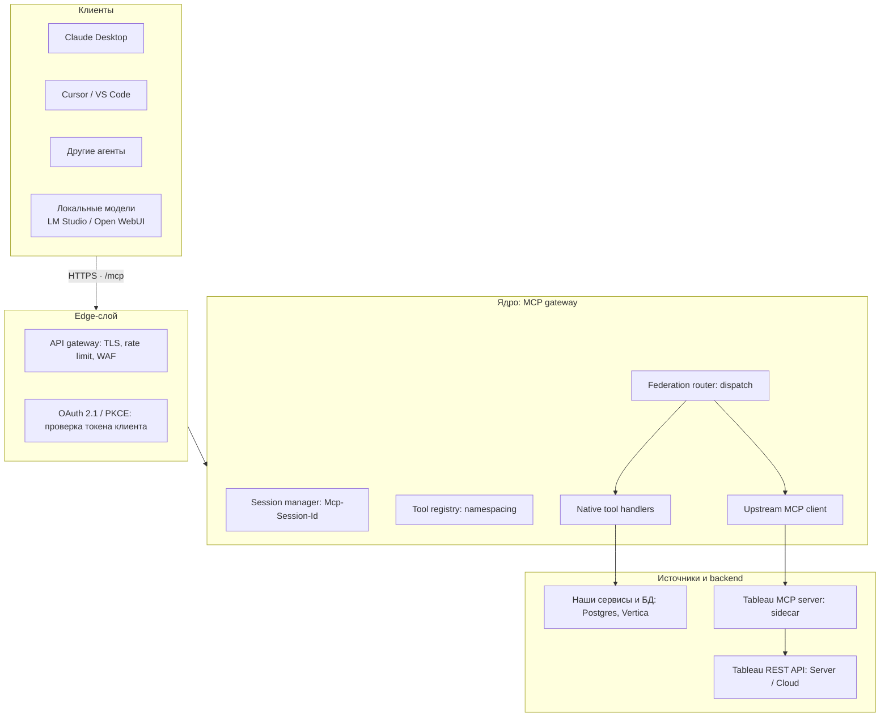
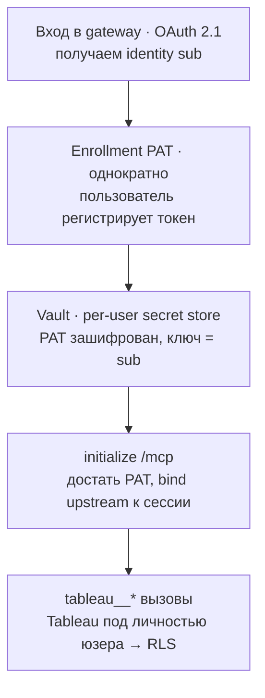
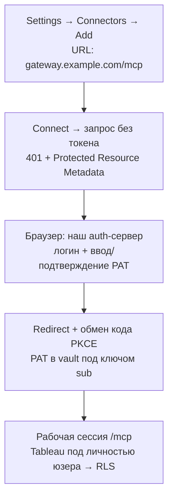
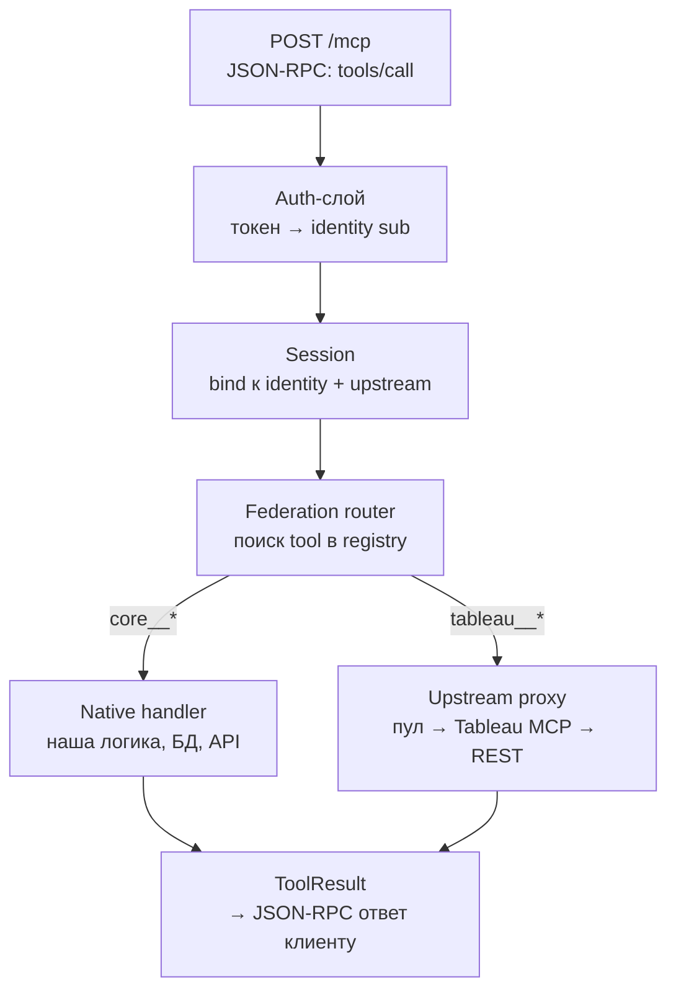

Дизайн-документ. Один MCP-сервер для Claude Desktop (и любых других MCP-клиентов): снаружи — единый endpoint `/mcp`, внутри — прокси к официальному Tableau MCP плюс наши собственные инструменты. Каждый пользователь ходит в Tableau под своими правами (per-user PAT).

---

## 1. Постановка задачи

Нужен сервис, который:

- отдаёт один HTTPS-endpoint `https://gateway.example.com/mcp` по транспорту Streamable HTTP;
- сводит в один плоский список tools инструменты официального Tableau MCP и наши кастомные;
- обеспечивает per-user доступ — каждый ходит в Tableau под собственным токеном, чтобы row-level security (RLS) соблюдалась нативно на стороне Tableau, а не переписывалась у нас;
- по умолчанию работает с Claude Desktop, но не привязан к нему — любой MCP-совместимый клиент тоже должен подключаться (это даёт нам опциональный фолбэк на локальные модели, см. раздел 8).

---

## 2. Главная идея: tool federation

Сервис работает одновременно в двух ролях.

**Снаружи** — MCP-сервер. Клиент видит один источник инструментов и не знает, что часть из них проксируется в Tableau, а часть исполняется локально.

**Внутри** — MCP-клиент. Сам подключается к официальному `@tableau/mcp-server`, забирает оттуда tools, плюс регистрирует собственные нативные.

На уровне протокола это просто один список tools. Это и есть федерация инструментов.

---

## 3. Развилка реализации: пишем сами или берём готовое

### Вариант 1 — пишем сами

Полный контроль, минимум зависимостей, но всю обвязку (auth, vault, пул сессий Tableau, observability, retry, rate-limit, Admin UI) делаем руками. Подробная архитектура — в разделе 9.

- **(+)** Можно подогнать под любые нюансы Tableau MCP, под нашу инфраструктуру, под наши схемы аутентификации.
- **(+)** Стек выбираем сами — Node/TS или Python, минимум сервисов.
- **(−)** Месяцы работы на инфраструктуру вместо бизнес-логики.
- **(−)** Свои тесты, свой Admin UI, свои метрики, свой релизный цикл - сильно растягивается время разработки.

### Вариант 2 — на базе IBM ContextForge

**IBM/mcp-context-forge** (Apache 2.0) — open-source MCP gateway-платформа от IBM. Делает из коробки именно то, что мы строим: федерацию MCP-серверов под одним endpoint, REST→MCP-адаптер, плагины для кастомных инструментов, Admin UI, JWT/OAuth, OpenTelemetry-трассировку, multi-cluster через Redis, поддержку forwarding'а пользовательских токенов в апстрим через `X-Upstream-Authorization`.

Как это ложится на нашу задачу:

- **Tableau MCP** регистрируется как federated MCP server. Поскольку он stdio — оборачивается утилитой `mcpgateway.translate`, и снаружи становится HTTP/SSE.
- **Кастомные инструменты** — это либо плагины ContextForge, либо отдельный MCP-сервер, который регистрируется в общем каталоге gateway.
- **Per-user PAT** — через user-scoped OAuth-токены платформы плюс forwarding в заголовке `X-Upstream-Authorization`. ContextForge передаёт личный токен пользователя в апстрим, не показывая его модели.
- **Claude Desktop** видит `https://gateway/servers/<uuid>/mcp` как обычный удалённый MCP-server с OAuth — тот же сценарий, что мы и так планируем.

**Trade-off:**

- **(+)** Экономим месяцы работы на инфраструктуре, получаем 7000+ тестов, Helm-чарты, готовый Admin UI, observability, плагин-фреймворк.
- **(+)** Стандартный API gateway pattern — легче передать команде, легче нанимать, легче объяснять security и compliance.
- **(−)** Тяжёлый стек: FastAPI + PostgreSQL + Redis + Nginx (есть lite-вариант на SQLite, но всё равно Python-сервис со своим UI).
- **(−)** Зависимость от внешнего проекта и его релизного цикла; кастомизация — только через их плагин-контракт или форк.

**Важный нюанс по per-user.** ContextForge решает per-user не через отдельный процесс Tableau MCP на пользователя, а через forwarding токена в заголовке на каждый вызов. Это ближе к нашему **Варианту B** из раздела 5 (легче по ресурсам). Но Tableau MCP «из коробки» логинится один раз при старте процесса из env-переменных, поэтому такая схема будет работать только если:

1. в наш Tableau MCP можно научить per-request auth (правка апстрима), либо
2. ContextForge действительно поднимает per-сессию Tableau MCP под пользователя — это уже гибрид: ContextForge как фронт + наш собственный sidecar-флот для Tableau MCP по identity.

Это надо проверить экспериментом до коммита в один из вариантов.

**Рекомендация:** начинать с эксперимента над ContextForge — если он покрывает нашу схему per-user без существенных правок, это сильно сократит сроки. Свой gateway — резервный план, если ContextForge упрётся в Tableau-специфику.

---

## 4. Высокоуровневая архитектура



**Edge-слой.** Reverse-proxy (Envoy / Traefik / nginx) терминирует TLS, делает rate limiting и WAF. Здесь же проверяется аутентификация: gateway выступает как OAuth 2.1 resource server, а саму авторизацию делегирует IdP (Keycloak / Okta / Auth0) или Tableau Connected Apps. Токен, которым клиент авторизуется в gateway, и креды, которыми gateway ходит в Tableau, — это разные вещи; их нельзя смешивать.

**Ядро.** Session manager держит непрерывность сессии через заголовок `Mcp-Session-Id`; при горизонтальном масштабировании состояние выносится в Redis. Tool registry — каталог всех инструментов с namespacing (`tableau__*`, `core__*`) для защиты от коллизий имён. Federation router — диспетчер: по префиксу имени отправляет вызов либо в нативный handler, либо через upstream MCP client в Tableau MCP.

**Источники и backend.** Tableau MCP запускается как sidecar (stdio или HTTP) и сам ходит в Tableau REST API. Кастомные инструменты ходят в наши собственные сервисы и базы.

---

## 5. Главное решение: чьими правами ходить в Tableau

Официальный Tableau MCP берёт PAT из env-переменных при старте процесса и логинится один раз — то есть «из коробки» это один статичный токен на весь процесс. Для per-user это не подходит, отсюда развилка.

### Вариант A — per-session upstream

Gateway поднимает (или берёт из пула) отдельный инстанс Tableau MCP под PAT конкретного пользователя и привязывает его к `Mcp-Session-Id`. Все `tableau__*`-вызовы в рамках сессии идут в этот инстанс → Tableau видит реального пользователя → RLS соблюдается нативно.

- **(+)** Сохраняются готовые инструменты Tableau MCP без правок, честный per-user доступ.
- **(−)** Процесс на пользователя, нужен пул с TTL-эвикцией по простою.

### Вариант B — gateway сам ходит в Tableau REST

Gateway делает `POST /auth/signin` с PAT пользователя, получает короткоживущий `X-Tableau-Auth` токен, кэширует его и сам дёргает REST через кастомные инструменты.

- **(+)** Легче по ресурсам — хранится строка-токен, а не процесс.
- **(−)** Готовые инструменты Tableau MCP теряются, всё нужное переписывается руками.

**Trade-off:** цена рантайма (A) против цены разработки (B). Для широкого набора Tableau-инструментов — Вариант A; для двух-трёх операций при большом числе пользователей — Вариант B. Если идём на ContextForge — реализуется скорее по схеме B (forwarding токена), и это надо иметь в виду.

---

## 6. Поток per-user PAT (Вариант A)

PAT никогда не отправляется заголовком на каждый запрос. Вместо этого — **enrollment**: пользователь один раз аутентифицируется в gateway (OAuth 2.1 → identity `sub`) и регистрирует свой PAT, который gateway кладёт в per-user vault зашифрованным под ключом `sub`. После этого PAT по сети не ходит.



### Что критично не сломать

- **Жёсткая привязка identity → PAT → session.** Ключ в vault — всегда `sub` из проверенного токена, а не значение из тела запроса или заголовка, которое можно подменить. Сессия A никогда не должна дотянуться до PAT сессии B.
- **Протухание токенов.** PAT в Tableau истекают (по умолчанию через 15 дней простоя плюс жёсткий срок), а `X-Tableau-Auth` после signin живёт пару часов. Нужна обработка: `401` от Tableau → переподписаться → один ретрай; если PAT мёртв — внятная ошибка пользователю, а не сырой стектрейс. Signin-токен кэшируется на пользователя.
- **Секреты не логируются.** PAT и токены лежат только в зашифрованном vault и в памяти на время сессии. Никогда — в логах, URL'ах и текстах ошибок.

---

## 7. Интеграция с Claude Desktop

Важное ограничение Claude Desktop: к **удалённым** серверам он подключается **только через Settings → Connectors**, а не через `claude_desktop_config.json`. При этом UI кастомного коннектора опирается на OAuth (или authless) и **не отдаёт произвольные HTTP-заголовки** — кредами управляет сам Claude. Значит «вписать PAT в заголовок» через нативный коннектор нельзя. Отсюда два пути.

### Путь 1 — нативный коннектор + OAuth (основной)

Главный приём: **браузерное окно OAuth и есть страница enrollment.** Пользователь не выходит из Claude Desktop — жмёт Connect, Claude открывает браузер на *нашем* auth-сервере, и там пользователь логинится и вводит/подтверждает PAT. PAT сохраняется на сервере под его identity.



Технически: gateway — удалённый MCP-сервер с OAuth 2.1. Claude шлёт неаутентифицированный запрос → сервер отвечает `401` с `WWW-Authenticate` на Protected Resource Metadata → Claude находит authorization server, регистрируется как клиент, редиректит пользователя на URL авторизации с PKCE-challenge (S256) → пользователь логинится и даёт согласие → код обменивается на токен. **Поле ввода PAT встраивается в шаг «логин и согласие» — это наша страница.**

Нюанс для allowlist: callback-URL у Claude — `https://claude.ai/api/mcp/auth_callback`, в будущем может смениться на `claude.com`; лучше разрешить оба.

### Путь 2 — stdio-мост `mcp-remote` (фолбэк под «сырой» PAT)

Если OAuth поднимать в условиях контура заказчика нереально и нам нужен именно PAT-в-конфиге, удалённый сервер прячется за локальным stdio-процессом — для Claude Desktop это «локальный» сервер, поэтому конфиг разрешён и заголовки доступны.

```json
{
  "mcpServers": {
    "tableau-gw": {
      "command": "npx",
      "args": ["-y", "mcp-remote", "<https://gateway.example.com/mcp>",
               "--header", "X-Tableau-PAT-Name:${PAT_NAME}",
               "--header", "X-Tableau-PAT-Value:${PAT_VALUE}"],
      "env": { "PAT_NAME": "...", "PAT_VALUE": "..." }
    }
  }
}
```

Изоляция per-user автоматическая — у каждого свой конфиг. Минусы: PAT в локальном файле, ручная правка JSON, токен уходит заголовком на каждый запрос (gateway обязан его не логировать). Альтернатива `mcp-remote` для ContextForge — встроенный `mcpgateway.wrapper`, делает то же самое.

**Вывод:** для нескольких пользователей с разными правами — Путь 1. **Передавать PAT в чат-сообщение Claude нельзя** — он попадёт в транскрипт и пройдёт через модель.

---

## 8. Запасной вариант — локальные модели

Так как gateway снаружи — стандартный MCP-сервер, к нему может подключаться любой MCP-совместимый клиент. Это бесплатно даёт нам опцию отвязки от Claude/cloud, если так потребует политика безопасности, контур, стоимость или просто желание не зависеть от одного вендора.

Что подходит:

- **LM Studio** (с версии 0.3.17 нативно поддерживает MCP) — десктоп-приложение, по UX близко к Claude Desktop, работает с локальными моделями (Qwen, Llama, Mistral и т.д.). Подключение — через `mcpServers` в `mcp.json`; для HTTP-gateway используется тот же приём stdio-моста (`mcp-remote` или `mcpgateway.wrapper`).
- **Open WebUI + mcpo** — корпоративный веб-интерфейс, ставится on-prem, поддерживает локальные модели через Ollama и MCP-инструменты через прокси `mcpo`. Хорошо подходит, если нужен браузерный UI без установок на машинах пользователей.
- **Ollama + IDE-хост** (Cline, Continue.dev, mcphost) — нет отдельного GUI, но интегрируется в VS Code/JetBrains. Удобно для разработчиков, не подходит для аналитиков.

Что это значит для архитектуры:

- В gateway ничего менять не нужно — мы и так строим стандартный MCP-сервер. Это лишь означает, что **обязательно нужно поддержать оба сценария интеграции** (раздел 7, Путь 1 и Путь 2), а не только OAuth/Claude.
- Per-user в схеме с локальными клиентами обычно идёт по Пути 2 — PAT лежит у пользователя в локальном конфиге, gateway получает его в заголовке.
- **Качество** результатов с локальными моделями ниже, чем с Claude — это запасной вариант, а не равноправная альтернатива. Tool use с маленькими моделями работает менее стабильно, могут потребоваться более жёсткие схемы инструментов и более короткие промпты.

**Главный вывод:** фолбэк на локальные модели обходится почти бесплатно в плане архитектуры — он встроен в выбранный паттерн MCP. Достаточно один раз убедиться, что gateway работает не только в OAuth-сценарии Claude Desktop, но и в stdio-сценарии mcp-remote.

---

## 9. Внутренняя архитектура gateway (если идём по Варианту 1 из раздела 3)

Если строим сами — главная идея, которая держит весь сервис: **единый внутренний контракт `Tool`, чтобы нативные и проксируемые инструменты выглядели для роутера одинаково.** Тогда gateway — это JSON-RPC сервер + роутер поверх реестра инструментов + пул апстрим-подключений.

```tsx
interface GatewayTool {
  name: string;              // namespaced: "tableau__query-datasource" | "core__enrich_report"
  description: string;
  inputSchema: JSONSchema;   // то, что отдаём в tools/list
  source: "native" | "upstream";
  invoke(args: unknown, ctx: CallContext): Promise<ToolResult>;
}

interface CallContext {
  identity: Identity;                            // sub из OAuth-токена
  sessionId: string;
  getTableauUpstream(): Promise<UpstreamClient>; // лениво даёт per-user сессию Tableau
  logger: Logger;                                // с редакцией секретов
  signal: AbortSignal;                           // таймауты / отмена
}
```

Нативный инструмент реализует `invoke` напрямую. Проксируемый — тот же `GatewayTool`, чей `invoke` дёргает `ctx.getTableauUpstream()` и форвардит JSON-RPC `tools/call` в Tableau MCP. Роутеру всё равно: находит инструмент по имени и зовёт `invoke`.

### Путь вызова tools/call



### Upstream manager (пул)

Сюда уходит большая часть сложности. `Map<sub, UpstreamHandle>`, где handle держит процесс/HTTP-клиент Tableau MCP, актуальный `X-Tableau-Auth` токен, счётчик inflight, `lastUsed` и срок истечения signin. Создаётся лениво при первом `tableau__*`-вызове. Фоновый sweeper раз в минуту эвиктит хэндлы с `lastUsed` старше TTL и `inflight == 0`, делая signout. Сверху — общий потолок инстансов и LRU-вытеснение под давлением. Обёртка над протуханием: `401` → переподписка PAT из vault → один ретрай; мёртвый PAT → `ToolResult` с `isError`.

### Хитрость с каталогом: list один раз, invoke на пользователя

Набор инструментов Tableau MCP не зависит от пользователя — от него зависят только возвращаемые данные. Значит `tools/list` не нужно гонять per-user: каталог дискаверится один раз (служебным/шаблонным подключением), имена префиксуются, каждый оборачивается в прокси-`GatewayTool` и кэшируется. Инвалидация — по нотификации `listChanged`. Per-user поднимается только invocation — процесс на пользователя ради списка не нужен.

### Конкурентность и главное ограничение масштабирования

Node держит много сессий параллельно; корреляция JSON-RPC ответов по `id` уже делается клиентом из SDK. Реальная засада: **дочерние процессы Tableau MCP привязаны к породившему их инстансу gateway** — между репликами их не пошарить. Развилка:

- **Session affinity** на балансировщике по `Mcp-Session-Id` (запросы пользователя липнут к одной реплике, метаданные сессии в Redis для фейловера) — проще, но реплики stateful.
- **Отдельный HTTP-флот Tableau MCP**, адресуемый по identity — gateway почти stateless, сессии Tableau живут во флоте — чище на масштабе, но больше инфры.

Это главное решение по внутренней архитектуре. Если идём через ContextForge, оно за нас уже решено их кластерной схемой с Redis.

### Устойчивость и ошибки

Протокольные сбои (плохой запрос, неизвестный метод) → JSON-RPC error. Сбой исполнения инструмента → `ToolResult` с `isError: true` (по конвенции MCP такие ошибки идут в результат, чтобы их видела модель). Таймауты — через `AbortSignal`. На Tableau — circuit breaker: если он лёг, нативные инструменты обязаны продолжать работать (частичная деградация). Сквозная редакция: PAT и токены не попадают в логи и тексты ошибок.

### Регистрация кастомных инструментов

Каждый нативный инструмент — модуль, экспортящий `GatewayTool` (или фабрику). Реестр собирает их на старте (явный список импортов или скан директории `tools/`). Аргументы валидируются против `inputSchema` (zod → JSON Schema). Добавление инструмента — один файл плюс строка регистрации, без правок роутера. Наблюдаемость вешается декоратором над `invoke`: спан OpenTelemetry, латентность и счётчик ошибок на инструмент, гейджи пула.

---

## 10. Открытые вопросы

- **ContextForge vs свой gateway.** Проверить экспериментом, насколько ContextForge ложится на per-user-сценарий с Tableau MCP. Если ложится — это сильно сокращает сроки.
- **Tableau Server (on-prem) или Tableau Cloud** — влияет на способ деплоя и на возможность федерации identity через Connected Apps вместо хранения PAT.
- **Ожидаемое число одновременных пользователей** — влияет на выбор Вариант A vs B и на модель масштабирования (session affinity vs отдельный флот).
- **Нужен ли весь набор инструментов Tableau MCP или две-три операции** — влияет на выбор A vs B.
- **Будут ли локальные модели реально использоваться** или это просто страховка — влияет на приоритет Пути 2 и на необходимость минимального тестирования через `mcp-remote`.
