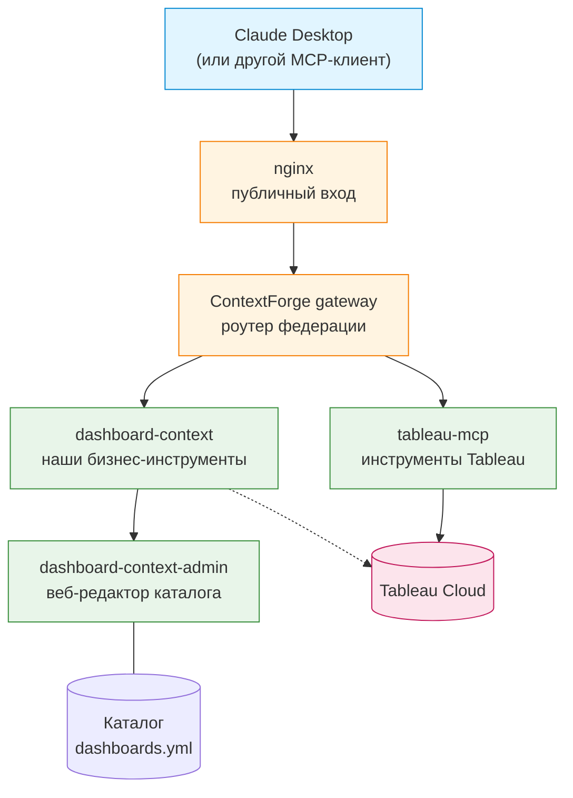
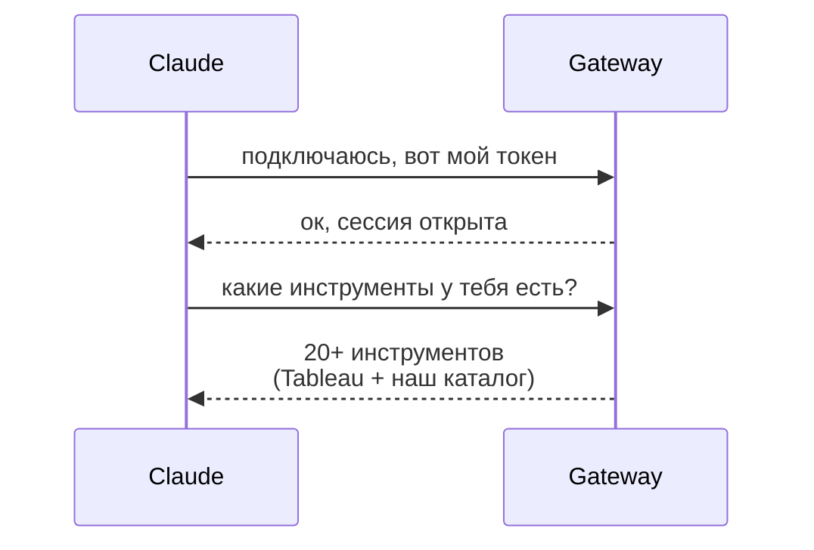
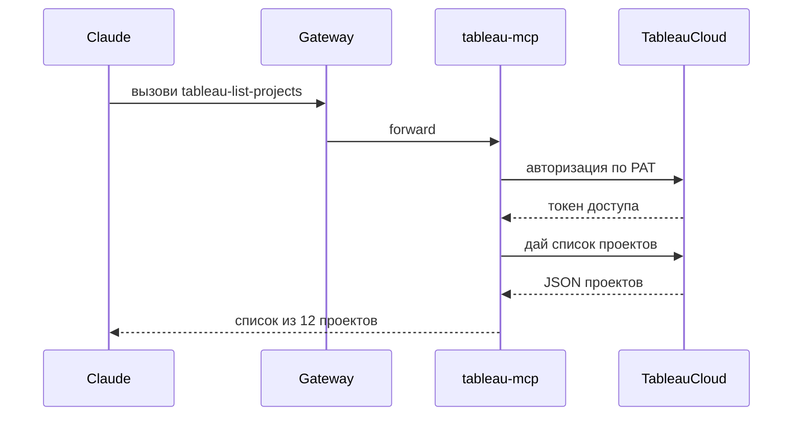
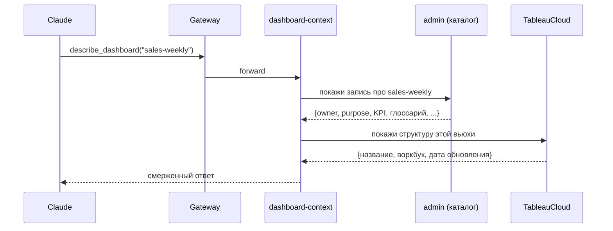

# Tableau MCP Gateway — обзор архитектуры

Документ описывает, **что за систему мы построили, зачем она нужна бизнесу и куда развивается**. Ориентирован на бизнес-часть команды: технические детали присутствуют там, где без них нельзя понять смысл, но всё, что касается развёртывания и эксплуатации, вынесено в отдельные материалы.

---

## 1. Зачем это нужно

**Проблема.** Аналитики строят десятки-сотни дашбордов в Tableau. Когда бизнес приходит с вопросом "почему в отчёте за прошлый квартал такая цифра" или "к кому идти за уточнением по этому графику", ответ занимает часы: надо найти владельца, разобраться в источниках, вспомнить какие фильтры применены, что означает конкретный KPI. Знание распылено: часть — внутри самого Tableau (структура дашборда), часть — в головах у аналитиков (бизнес-смысл, оговорки, история).

**Решение.** Мы даём Claude (или любому другому LLM-клиенту, работающему по протоколу MCP) прямой доступ к двум источникам:

1. **К самому Tableau** — LLM видит структуру дашбордов, список воркбуков, source-датасеты, автора, дату обновления.
2. **К нашему бизнес-каталогу** — редактируемая через веб-интерфейс база знаний: назначение дашборда, ответственный, целевая аудитория, ключевые метрики, глоссарий терминов, оговорки и известные подвохи.

Когда пользователь спрашивает "что показывает дашборд Sales weekly", модель объединяет обе половины в один ответ: она видит и **форму** дашборда (что в нём технически), и его **смысл** (для кого и зачем). Ответ получается в терминах, которые понятны бизнес-пользователю, а не в языке SQL/Tableau-API.

**Ценность:**
- Аналитики перестают быть "справочным бюро" по своим дашбордам — большинство вопросов уровня "что / кто / когда / зачем" LLM закрывает сама.
- Бизнес получает ответ моментально, без пинга в мессенджерах и ожидания.
- Каталог — живой единый источник правды: если владелец дашборда обновил "purpose" или добавил новый KPI, все, кто спрашивает про этот дашборд, сразу видят актуальную информацию.
- Ошибки типа "спросил у ChatGPT, он придумал" исчезают: модель говорит только из данных, которые ей отдали Tableau и каталог. Если каталог пуст — модель это озвучивает вместо галлюцинации.

---

## 2. Из чего состоит система

Один вход снаружи (`/mcp` через nginx на публичном порту), внутри — четыре независимых сервиса, каждый со своей узкой ответственностью.

### Кто за что отвечает

- **nginx** — публичное лицо. Только он торчит наружу, всё остальное — во внутренней сети. Проверяет входящий JWT-токен клиента, пробрасывает запросы гейту.
- **ContextForge gateway** — маршрутизатор запросов. Знает, что "инструмент `tableau-list-projects`" идёт в `tableau-mcp`, а "инструмент `dashboard-context-list-dashboards`" — в `dashboard-context`. Клиент видит только его, детали внутренней архитектуры от клиента скрыты. Открытая платформа от IBM, мы её не форкали — только настроили.
- **tableau-mcp** — официальный сервер от Tableau. Даёт 18 готовых инструментов: перечислить проекты/воркбуки/вьюхи, получить структуру дашборда, скачать данные, забрать screenshot и т.д. Мы его берём как есть, только запускаем в специальном режиме (см. §4).
- **dashboard-context** — наш собственный сервис, две инструменты:
  - `list_dashboards` — список всех задокументированных дашбордов из каталога;
  - `describe_dashboard` — детальное описание одного дашборда: смерженные данные из Tableau + бизнес-контекст из каталога.
- **dashboard-context-admin** — веб-редактор каталога. Отдельная страничка с формами: поля "название / владелец / назначение / KPI / глоссарий" и т.д. Тот, кто отвечает за дашборд, заходит туда, обновляет запись — все последующие запросы к LLM видят новую версию. Работает и как REST API — можно править из скриптов, если появится массовое обновление.

---

## 3. Как это выглядит для пользователя

Три сценария снизу — то, что реально происходит за кулисами, когда пользователь общается с Claude.

### 3.1. Первое подключение (один раз)

Claude Desktop устанавливает связь с гейтом, узнаёт список доступных инструментов.

### 3.2. Обычный вопрос про Tableau

Пользователь: "покажи все проекты, которые есть в нашем Tableau".

### 3.3. Вопрос про конкретный дашборд

Пользователь: "расскажи, что показывает дашборд Sales Weekly и кто его владелец".

Модель получает и техническую сторону (что в дашборде технически), и человеческую (для чего он и что означает) в одном ответе — из этого она строит понятное объяснение.

---

## 4. Почему такая архитектура (и почему это важно бизнесу)

### 4.1. Модульность через MCP-протокол

**Что сделано:** мы не написали "монолитного бота с Tableau внутри". Каждый источник данных завёрнут в отдельный MCP-сервер, а гейт их федерирует.

**Что это даёт:**
- Завтра добавляется 1С, Jira, внутренняя wiki — они подключаются к тому же гейту как ещё один federated server. Клиент (Claude) увидит просто новые инструменты, никаких изменений на его стороне.
- Официальный Tableau MCP развивается силами Tableau — мы получаем новые инструменты (например, работу с Pulse-метриками) бесплатно, просто обновив версию.
- Наш кастомный `dashboard-context` изолирован от всего остального. Ошибка в нём не роняет доступ к Tableau, и наоборот.

### 4.2. Каталог как отдельный сервис с веб-интерфейсом

**Что сделано:** бизнес-контекст живёт в отдельном сервисе-админке. Владелец дашборда правит запись в браузере — и всё.

**Что это даёт:**
- Правки контекста не требуют деплоя, ребилда, привлечения разработчиков. Обычный аналитик может сам обновить `owner` или добавить пункт в глоссарий за 30 секунд.
- Данные хранятся в человеко-читаемом файле (YAML), который при желании коммитится в git — есть история изменений, можно откатить, можно ревьюить как обычный pull request.
- Если завтра каталог надо переехать в реальную БД (Postgres, Airtable, Confluence) — меняется только один сервис (`dashboard-context-admin`), MCP-серверу всё равно откуда данные, лишь бы была HTTP-ручка `/api/dashboards`.

### 4.3. Гейт от IBM (не свой велосипед)

**Что сделано:** мы взяли готовую open-source платформу IBM ContextForge вместо того, чтобы писать свой роутер federated MCP-серверов.

**Что это даёт:**
- Из коробки получаем: JWT/OAuth, RBAC (роли и права), Admin UI, health-чеки, OpenTelemetry-трассировку, поддержку Redis для multi-cluster, forwarding пользовательских токенов через `X-Upstream-Authorization` (нужно для перехода на per-user auth в будущем).
- Всё это — регулярно поддерживаемая IBM'ом библиотека под Apache 2.0. Мы не тратим сроки на переизобретение gateway-слоя и не должны его сами обновлять по безопасности.
- Есть встроенный Admin UI для управления federated-серверами — если в проде надо добавить/убрать источник, это делается через веб без правки конфигов.

### 4.4. Токен вечный по умолчанию

**Что сделано:** admin-JWT, который прописывается в конфиг Claude Desktop, по умолчанию бессрочный.

**Что это даёт:**
- Настроил Claude один раз — и забыл. Не нужно раз в 30 дней бегать перевыпускать токен и обновлять конфиг у каждого пользователя.
- Отзыв доступа делается сменой `JWT_SECRET_KEY` (тогда протухают все токены сразу), либо переходом на per-user OAuth (см. роадмап).

### 4.5. Стateless-режим Tableau MCP

**Что сделано:** tableau-mcp запущен в специальном stateless-режиме.

**Что это даёт бизнесу:**
- Каждый запрос независим — не бывает "висящих сессий", которые накапливаются и жрут память.
- Гейт может параллельно обрабатывать много запросов без взаимных блокировок.
- Восстановление после сбоев мгновенное — сервису нечего "терять" при рестарте.

---

## 5. Ресурсы: что сейчас и что будет в проде

### 5.1. Что сейчас

Собранный стек в текущем виде — MVP с одним PAT'ом на всех, каталогом в YAML, без HA, без Keycloak, без сохранения истории обращений.

| Ресурс | Сейчас | Комментарий |
|---|---|---|
| **RAM** | ~10 GB под нагрузкой | Включает overhead Docker Desktop (~2–3 GB). Чистая нагрузка на стек — 5–7 GB, из них ContextForge gateway забирает больше половины (Python + FastAPI + миграции). |
| **Диск: образы контейнеров** | ~3.5 GB | Один раз при установке. Основной вес — гейт (~1.5 GB), Tableau MCP (~450 MB), Postgres (~450 MB), nginx (~250 MB). |
| **Диск: данные (Postgres)** | ~50 MB после инициализации | Схема гейта + seed админ-юзер. Растёт медленно — по мере накопления записей о federated servers, аудит-логов Admin UI. |
| **Диск: каталог** | ~50 KB | YAML-файл, ~30 записей о дашбордах. Даже при 10 000 записях останется в пределах 30–50 MB. |
| **Диск: логи** | 100–500 MB/день | Зависит от активности. Держатся в docker log rotation (по умолчанию 10 × 50 MB на контейнер). |
| **Активные CPU-ядра** | 1–2 в idle, до 4 под нагрузкой | Компактный стек, узкое место обычно — сеть до Tableau Cloud, а не локальный процессор. |

### 5.2. Что будет в целевой проде

Целевая продакшн-конфигурация добавляет к текущему стеку четыре тяжёлых компонента:

- **Keycloak** (или совместимый IdP) — свой identity provider для per-user OAuth-авторизации. Заменяет "один admin-JWT на всех" на честного пользователя с ролями/командами.
- **Per-user Tableau-токены** — каждый ходит в Tableau под своими правами через forwarding токена в заголовке `X-Upstream-Authorization`. Row-level security соблюдается нативно на стороне Tableau.
- **HA** — как минимум 2 реплики гейта, каждый tableau-mcp/dashboard-context. Внешний балансировщик перед nginx. Redis используется как shared session store.
- **Observability** — OpenTelemetry + постоянное хранение traces/metrics/audit-logs в отдельном Postgres или ClickHouse. Нужно для troubleshoot'а и compliance-требований.

Плюс проектируется расширение бизнес-каталога (перевод из YAML в реляционную БД, интеграция с корпоративным AD для владельцев, автоматическая синхронизация метаданных из Tableau).

| Ресурс | В целевом проде | Что добавилось vs. сейчас |
|---|---|---|
| **RAM** | 20–30 GB под нагрузкой, 12–16 GB idle | +Keycloak (~1 GB), +2-я реплика гейта (~1 GB), +observability-хранилище (~2–4 GB на большом ретеншене), +рост RAM гейта под per-user session-tracking (~500 MB–1 GB), +больший размер connection pool до Tableau и Postgres. |
| **Диск: образы** | ~7 GB | +Keycloak (~700 MB), +OTel collector (~200 MB), +ClickHouse/Prometheus/Grafana если ставим полный observability-стек (~2 GB суммарно). |
| **Диск: данные (гейт-Postgres)** | 2–5 GB, растёт со временем | Per-user sessions, OAuth-refresh-tokens, аудит-лог всех вызовов инструментов, RBAC-правила по командам. |
| **Диск: Keycloak** | ~500 MB — 2 GB | Пользователи, роли, сессии, refresh-tokens, ключи подписи. Зависит от размера организации. |
| **Диск: observability** | 20–100 GB, зависит от retention | Traces всех вызовов инструментов, метрики latency/error rate, аудит-лог. Обычно ротируется по 30/90 дней. |
| **Диск: расширенный каталог** | 100 MB – 1 GB | Если переезжаем на Postgres с историей изменений и вложениями (например, скриншотами дашбордов) — растёт. |
| **Активные CPU-ядра** | 4–8 постоянно, до 12–16 в пик | Keycloak сам по себе прожорлив на подписи JWT, Postgres — на аналитические запросы к аудит-логу, гейт — на per-user route resolution. |

**Итого коэффициент роста:**
- RAM: **×2–3** (с 10 GB до 20–30 GB под нагрузкой)
- Диск для образов: **×2** (с 3.5 GB до 7 GB)
- Диск для данных: **×50–100** (с 50 MB до 2–5 GB для основной БД + отдельный retention для трассировки)

Это разумно для энтерпрайз-архитектуры и укладывается в типовые сервера в контурах заказчика. Для оценки железа: **одна VM с 32 GB RAM, 4 vCPU, 200 GB SSD** покрывает целевую нагрузку с запасом. Разнесение по кластеру рекомендуется только если LLM-нагрузка становится 10+ RPS постоянно.

---

## 6. Куда развиваемся (роадмап)

**Ближайшие итерации** — переход от MVP к проду:

1. **Keycloak + per-user OAuth**. Убираем "один PAT на всех", заменяем на честного пользователя. Каждый ходит в Tableau под собственным токеном, RLS Tableau начинает работать. Роли/команды/RBAC переезжают в Keycloak как единый источник правды.
2. **HA гейта**. Две-три реплики за балансировщиком, shared state через существующий Redis. Плановые перезапуски и rolling updates перестают ронять доступ.
3. **Observability**. OpenTelemetry-трассировка всех вызовов, метрики latency/success rate на дашборд, аудит-лог "кто когда какой инструмент вызывал". Обязательно для compliance и SRE.
4. **Каталог в БД**. YAML → Postgres, история изменений на уровне записи, интеграция с корпоративным AD для авто-заполнения `owner`.

**Средний горизонт** — расширение доступных инструментов:

- Подключение других источников кроме Tableau: 1С, DWH напрямую, корпоративная wiki, Jira, GitLab — как ещё federated MCP-серверы под тем же гейтом. Клиенту (Claude) ничего менять не надо, инструменты просто появляются.
- Обогащение бизнес-контекста: скриншоты дашбордов, ссылки на связанные документы, история "почему этот дашборд был создан", уровни sensitivity/PII-меток.

**Дальний горизонт** — production hardening и оптимизация:

- Rate limiting per-user (защита от abusive-агентов).
- Кэширование ответов Tableau-инструментов на уровне гейта (некоторые запросы одинаковы у разных пользователей).
- Возможность горячего добавления/удаления federated servers без рестарта гейта — уже поддерживается ContextForge, но требует настройки RBAC.

---

## 7. Ключевые ограничения текущей версии

Открытая коммуникация про то, что MVP пока **не** делает:

- **Все ходят в Tableau под одним техническим PAT'ом.** Row-level security на стороне Tableau игнорируется. Пользователь видит всё, к чему у PAT-владельца есть доступ. Фикс — п.1 из роадмапа (per-user OAuth).
- **Одна реплика каждого сервиса.** При перезапуске гейта — короткий downtime (10–30 секунд). Для внутреннего использования допустимо, для клиентской SLA — нужен HA (п.2).
- **История обращений не сохраняется.** Кто, когда, какие инструменты вызывал — не логируется в постоянное хранилище. Только stdout контейнеров в rolling docker-логах. Фикс — п.3 (observability).
- **Каталог — YAML-файл на диске.** Одновременное редактирование двумя людьми потенциально теряет одну из правок (last-write-wins). Для команды из 5–10 человек это ок, для 50+ — не масштабируется, нужен переход на БД (п.4).
