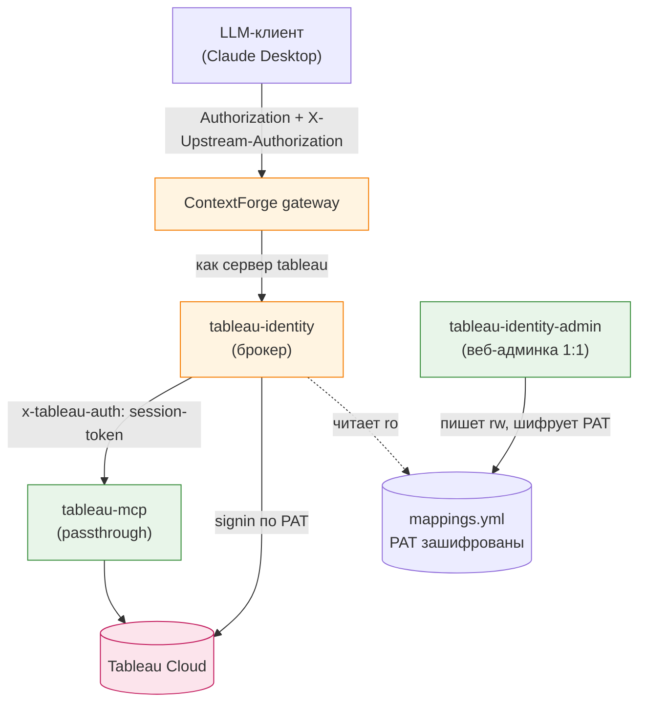
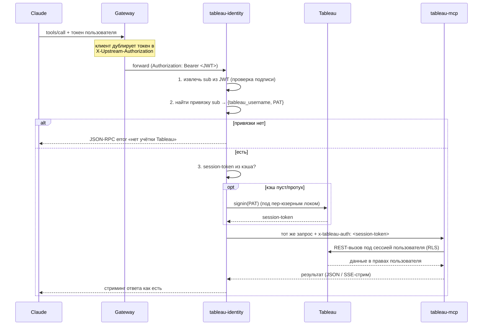

# tableau-identity — per-user привязка учёток Tableau (1:1) через PAT

Документ описывает сервис `tableau-identity`: зачем он, как встроен в стек, как
работает изнутри и как эксплуатируется. Он закрывает ключевое требование ТС —
**каждый ИИ-пользователь ходит в Tableau под своей личной учёткой (своим PAT),
наследуя её права (RLS)**, а не под одним общим техническим PAT.

---

## 1. Зачем это нужно

**Требование ТС (п.4.3, 5.4.2):** «сопоставление ИИ-пользователя с учётной
записью Tableau 1:1 (персональная учётка — персональный PAT)… вызовы инструментов
выполняются от имени сопоставленной учётной записи, наследуя её права (Row-Level
Security и др.)». Аутентификация коннектора к Tableau — **по PAT** (п.5.4.1).
Секреты (PAT) — **в защищённом виде** (п.5.5.4). Управление сопоставлением — через
**отдельную админку** (п.5.6.2).

**Проблема, которую это решает.** В базовом стеке был один технический PAT на
всех: RLS Tableau игнорировался, пользователь видел всё, к чему есть доступ у
владельца PAT. Нужно, чтобы Алиса видела ровно то, что видит Алиса в Tableau, а
Боб — то, что видит Боб.

**Почему нельзя просто «передать PAT в tableau-mcp per-request».** Официальный
tableau-mcp не принимает сырой PAT на каждый запрос — `PAT_NAME`/`PAT_VALUE`
берутся из env один раз на старте и не входят в список per-request overridable
переменных. Но у него есть режим **passthrough**: заголовок `x-tableau-auth` с
живым session-token Tableau на каждый запрос. А session-token как раз получают
**логином тем самым персональным PAT** (`POST /api/…/auth/signin`). Значит нужен
тонкий посредник, который делает обмен `PAT → session-token`. Это и есть
`tableau-identity`.

---

## 2. Где стоит в архитектуре

`tableau-identity` встаёт **в путь федерации перед tableau-mcp**. Гейт
регистрирует как MCP-сервер `tableau` именно брокер, а тот прозрачно проксирует
MCP-трафик в реальный tableau-mcp, подставляя per-user `x-tableau-auth`.



Два контейнера из одного образа (как у `dashboard-context`):
- **`tableau-identity`** — брокер в горячем пути. Читает `mappings.yml` (ro).
- **`tableau-identity-admin`** — веб-редактор привязок. Владеет `mappings.yml`
  (rw), шифрует PAT-секреты. Basic-auth, наружу через nginx не пробрасывается.

---

## 3. Как это работает — поток одного tool-вызова



Хендшейк MCP (`initialize`, `tools/list`, `ping`) в Tableau не ходит и токена не
требует — брокер пропускает его как есть, чтобы работала регистрация федерации
гейтом. Гейтинг применяется только к `tools/call`.

---

## 4. Ключевые технические решения (и почему именно так)

### 4.1. Один PAT = одна сессия → кэш сессий + пер-юзерный лок
Из доки Tableau (`security_personal_access_tokens`): *«Signing in again with the
same PAT … will terminate the previous session and result in an authentication
error»*. Отсюда три следствия, зашитые в `tableau_auth.py`:
1. **session-token кэшируется на пользователя** и переиспользуется между
   запросами (не логинимся на каждый вызов);
2. вокруг signin стоит **пер-юзерный `asyncio.Lock`** — иначе два параллельных
   запроса одного юзера сделают два signin и **убьют сессии друг другу**;
3. **signout после запроса не делаем** — сессия долгоживущая (240 мин idle по
   умолчанию), TTL обновления берём с запасом (`TABLEAU_SESSION_TTL_SECONDS`,
   дефолт 13800 с = 230 мин).

### 4.2. Протухание ловим по 401, а не гадаем
Реальный сигнал смерти сессии — `401` от passthrough-мидлвари tableau-mcp
(она валидирует токен через Tableau на каждый запрос). Брокер на 401 **один раз**
инвалидирует кэш, релогинится и повторяет запрос. TTL лишь снижает частоту этого.

### 4.3. Секреты зашифрованы на диске
`mappings.yml` хранит PAT-секрет только в виде **Fernet-шифртекста**
(`cryptography`), ключ — в `TABLEAU_IDENTITY_ENC_KEY`, рядом с данными не лежит.
Админ-API отдаёт наружу только публичные поля (`user`, `tableau_username`,
`pat_name`) — секрет не покидает сервис. Брокер читает файл напрямую (ro) и
дешифрует в памяти — секрет **никогда не ходит по HTTP в открытом виде**.

### 4.4. Непривязанный юзер не проваливается на общий PAT
Если у пользователя нет привязки, брокер возвращает чистую JSON-RPC-ошибку на
`tools/call` — **до tableau-mcp и его fallback-PAT запрос не доходит**. Так 1:1
соблюдается строго: нельзя случайно сходить в Tableau «не под собой».

### 4.5. Личность берём из проверенного токена
Клиент дублирует свой gateway-JWT в `X-Upstream-Authorization`; ContextForge
переименовывает его в `Authorization` для upstream. Брокер **проверяет подпись**
тем же секретом, что и гейт (defense-in-depth на внутренней сети), и берёт claim
`sub`. Поддельная подпись → «нет личности» → tool-вызов отклонён.

---

## 5. Из чего состоит (модули)

| Файл | Ответственность |
|---|---|
| `store.py` | Файловое хранилище привязок; шифрование PAT (Fernet); инвариант 1:1; reload по mtime; атомарная запись. |
| `tableau_auth.py` | Обмен PAT → session-token (signin/signout по докам Tableau); кэш сессий с пер-юзерным локом; `invalidate()`. |
| `identity.py` | Извлечение пользователя из gateway-JWT (проверка подписи, claim). |
| `broker.py` | ASGI-прокси: личность → сессия → инъекция `x-tableau-auth` → стриминг в tableau-mcp; гейтинг `tools/call`; retry на 401. |
| `admin.py` | Веб-UI + REST для 1:1-маппинга (Basic-auth); шифрует PAT при сохранении. |

---

## 6. Конфигурация (env)

**Брокер (`tableau-identity`):**

| Переменная | Назначение |
|---|---|
| `TABLEAU_MCP_URL` | upstream — реальный tableau-mcp (`http://tableau-mcp:3927/tableau-mcp`) |
| `BROKER_BASE_PATH` | путь, который слушает брокер (дефолт `/tableau-mcp`) |
| `TABLEAU_SERVER` / `TABLEAU_SITE_NAME` / `TABLEAU_API_VERSION` | куда логиниться PAT'ом |
| `TABLEAU_SESSION_TTL_SECONDS` | проактивное обновление сессии (дефолт 13800) |
| `MAPPINGS_PATH` | путь к `mappings.yml` (ro) |
| `TABLEAU_IDENTITY_ENC_KEY` | Fernet-ключ дешифровки PAT (**обязателен**) |
| `JWT_SECRET_KEY` / `JWT_ALGORITHM` | проверка подписи gateway-JWT |
| `IDENTITY_CLAIM` | claim личности (дефолт `sub`) |
| `IDENTITY_JWT_AUDIENCE` / `IDENTITY_JWT_ISSUER` | опц. проверка aud/iss |

**Админка (`tableau-identity-admin`):** `MAPPINGS_PATH` (rw),
`TABLEAU_IDENTITY_ENC_KEY`, `IDENTITY_ADMIN_USER` / `IDENTITY_ADMIN_PASSWORD`,
`IDENTITY_ADMIN_PORT` (дефолт 8021).

---

## 7. Эксплуатация

1. Сгенерировать ключ шифрования и вписать в `.env`:
   ```
   make identity-key   # → TABLEAU_IDENTITY_ENC_KEY=...
   ```
2. Поднять стек: `make up`. Брокер регистрируется в гейте как сервер `tableau`
   автоматически (bootstrap).
3. Открыть админку `http://localhost:8021/` (Basic-auth), завести привязки:
   *пользователь (sub, обычно email) → учётка Tableau + её персональный PAT*.
   PAT ложится в `mappings.yml` зашифрованным.
4. Завести пользователя и выдать ему **личный API-токен** (боевой путь):
   ```
   make provision-user EMAIL=alice@corp PASSWORD=<пароль> [ROLE=developer] [DAYS=90]
   ```
   Скрипт через реальные эндпоинты гейта создаёт пользователя
   (`POST /auth/email/admin/users`), опц. назначает роль
   (`POST /rbac/users/{email}/roles`) и выпускает личный API-токен
   (`POST /tokens`, `sub=email`), печатает токен + готовый сниппет Claude Desktop.
   > `make user-token` — DEV-only (форженый JWT в обход RBAC), для прода не годится.
5. Клиент (Claude Desktop) шлёт этот токен И дублирует его в
   `X-Upstream-Authorization` — гейт переименует его в `Authorization` для
   брокера. Дальше tool-вызовы идут под личной учёткой пользователя.

> **Соглашение об идентификаторе.** Личный API-токен гейта несёт `sub = email`
> (подпись HS256 ключом `JWT_SECRET_KEY`, `token_use=api`). Тот же email —
> ключ привязки в tableau-identity. Поэтому email в `make provision-user` и в
> `tableau-identity-admin` должен совпадать. (login-токен `/auth/email/login`
> несёт `sub=UUID` и для маппинга не подходит — используем именно API-токен.)

### Конфиг Claude Desktop (Model A)

```json
{
  "mcpServers": {
    "tableau-gateway": {
      "command": "npx",
      "args": ["-y", "mcp-remote", "http://<gateway>/mcp",
        "--header", "Authorization:Bearer <per-user-token>",
        "--header", "X-Upstream-Authorization:Bearer <per-user-token>"]
    }
  }
}
```

- `Authorization` — вход в гейт (кто ты для гейта, RBAC).
- `X-Upstream-Authorization` — тот же токен, который гейт пробросит в брокер как
  `Authorization` (подтверждено в исходниках ContextForge v1.0.4:
  `compute_passthrough_headers_cached` переименовывает его безусловно). Из него
  брокер достаёт `sub` и находит PAT.

Когда встанет Keycloak: пользователь логинится по OAuth, оба заголовка
заполняются его access-токеном автоматически — сам сервис `tableau-identity` при
этом не меняется, только источник токена.

> **Про потерю ключа.** `TABLEAU_IDENTITY_ENC_KEY` восстановить нельзя — при его
> смене привязки перестают дешифроваться, PAT-ы вносятся заново.

---

## 7.5. Tableau Server (on-prem)

Сервис работает и с Tableau Server, и с Tableau Cloud — REST-логин по PAT
идентичен, правило «один PAT = одна сессия» действует и на Server (подтверждено
по server-доке Tableau). Отличается только конфиг:

- **`TABLEAU_SERVER`** — URL вашего Server (напр. `https://tableau.company.kz`).
- **`TABLEAU_API_VERSION`** — на Server версия API **пинится к релизу** (Cloud —
  всегда последняя). Выставьте под свою версию, иначе `/auth/signin` может отдать
  404. Ориентир: 2022.3→`3.17`, 2023.1→`3.19`, 2023.3→`3.21`, 2024.2→`3.24`.
- **`TABLEAU_SITE_NAME`** — для дефолтного сайта Server оставьте пустым (`""`);
  для именованного сайта — его `contentUrl`.
- **`TABLEAU_SSL_VERIFY`** — on-prem Server часто с внутренним/self-signed
  сертификатом. `true` (дефолт) — строгая проверка; `false` — не проверять
  (только доверенная сеть); **путь к CA-bundle** — корректный вариант: положите
  корневой сертификат в контейнер (примонтируйте) и укажите путь.
- **PAT на Server включены по умолчанию** (явно включать надо только
  impersonation server-админов — мы его не используем, у нас реальные
  персональные PAT).
- Часть инструментов tableau-mcp (VizQL Data Service `query-datasource`, Pulse)
  требует Server 2024.2+ — это ограничение набора инструментов, не брокера.

## 8. Соответствие ТС

| Пункт ТС | Как закрыт |
|---|---|
| 5.4.1 — аутентификация к Tableau по PAT | signin персональным PAT пользователя |
| 5.4.2 — 1:1 сопоставление + наследование прав (RLS) | привязка user→PAT, вызовы под личной сессией |
| 5.5.4 — секреты в защищённом виде | PAT зашифрованы (Fernet), наружу не отдаются |
| 5.6.2 — админка сопоставления пользователь↔PAT | `tableau-identity-admin` (UI + REST) |

---

## 9. Ограничения и развитие

- **Внешний IdP (Keycloak, RS256/JWKS).** Сейчас проверяется HS256-подпись
  встроенного OAuth-провайдера ContextForge. Под Keycloak добавляется отдельная
  ветка валидации по JWKS в `identity.py` — это по ТС «архитектурная возможность».
- **Fallback-PAT в tableau-mcp.** Для старта tableau-mcp всё ещё нужен `PAT_*` в
  env, но брокер гарантирует, что для `tools/call` он не используется (см. 4.4).
  Как защиту в глубину туда можно посадить read-only сервисную учётку.
- **Хранилище.** `mappings.yml` на диске достаточно для команды; при росте
  переносится в БД гейта (метахранилище) без изменения контракта брокера.

---

## 10. Проверка работоспособности

- **Юнит-тесты:** `deploy/tests/test_tableau_identity.py` — 24 теста на store,
  tableau_auth, identity, broker, admin (шифрование, инвариант 1:1, единственный
  signin под локом, инъекция `x-tableau-auth`, гейтинг `tools/call`, retry на
  401). Запуск: `make test`.
- **Живой стенд:** реальные брокер + админка + фейковые Tableau и tableau-mcp
  поднимаются на localhost и прогоняется полный HTTP-сценарий — привязка через
  админку, обмен PAT→session, переиспользование сессии, блокировка непривязанного,
  авто-релогин на 401, passthrough хендшейка, отказ поддельной подписи.
- **Шов с гейтом:** проброс личности клиент → ContextForge → брокер подтверждён
  чтением исходников гейта v1.0.4 (`compute_passthrough_headers_cached` на пути
  федеративного вызова инструмента ставит `Authorization` из
  `X-Upstream-Authorization` безусловно). Финальная приёмка — прогон через
  поднятый `make up` реальным MCP-клиентом.
