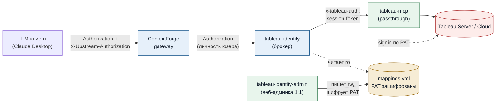
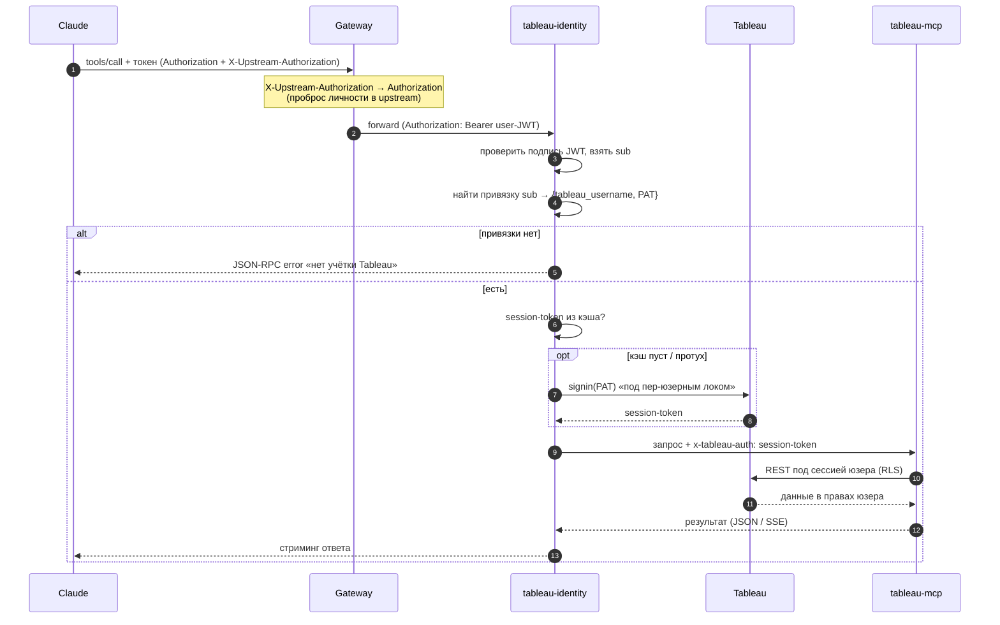
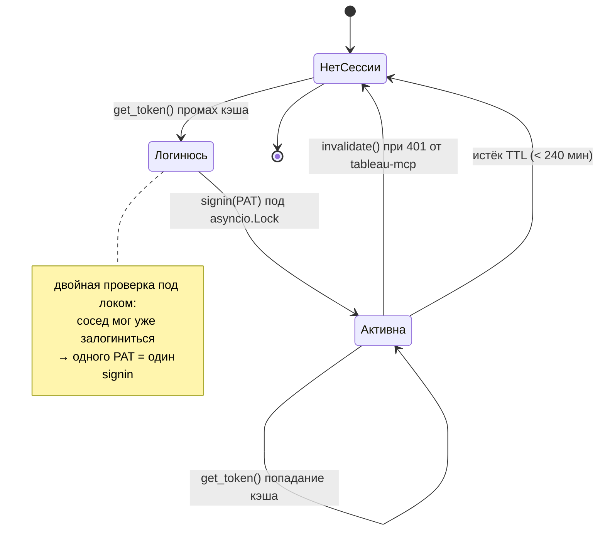
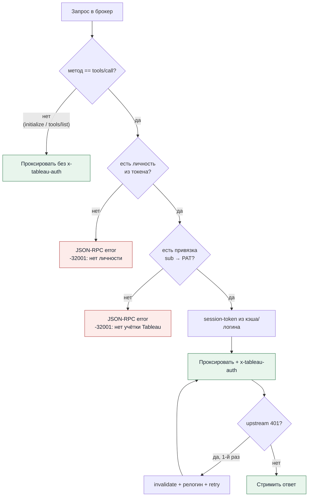
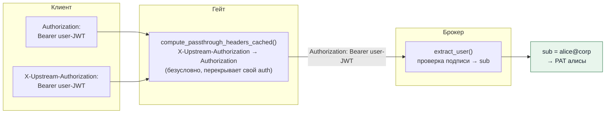
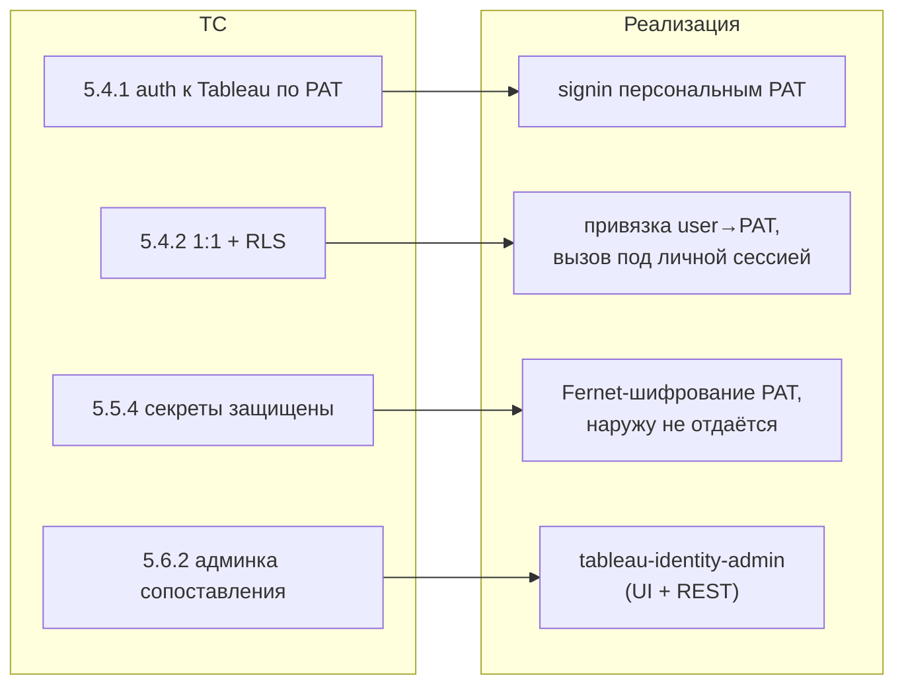

# tableau-identity — схемы

Диаграммы к сервису per-user привязки учёток Tableau (1:1 через PAT). Рендерятся
как mermaid (GitHub / Obsidian / VS Code с mermaid-плагином). Текстовая дока —
[TABLEAU-IDENTITY.md](../TABLEAU-IDENTITY.md).

---

## 1. Архитектура: где стоит брокер

Гейт регистрирует как MCP-сервер `tableau` **брокер**, а он проксирует в реальный
`tableau-mcp`, подставляя per-user session-token.

---

## 2. Поток одного tool-вызова

Хендшейк (`initialize`/`tools/list`) в Tableau не ходит и токена не требует —
пропускается как есть. Гейтинг применяется только к `tools/call`.

---

## 3. Кэш сессий и правило «один PAT = одна сессия»

Docs Tableau: повторный signin тем же PAT убивает предыдущую сессию. Поэтому
токен кэшируется на юзера, а signin обёрнут пер-юзерным локом.

---

## 4. Гейтинг `tools/call` в брокере

Непривязанный юзер получает чистую ошибку — до общего PAT запрос не доходит.

---

## 5. Как личность долетает до брокера (шов с гейтом)

Проверено **исполнением** настоящей функции ContextForge v1.0.4
`compute_passthrough_headers_cached` против реального кода брокера (без стека).

---

## 6. Соответствие ТС

