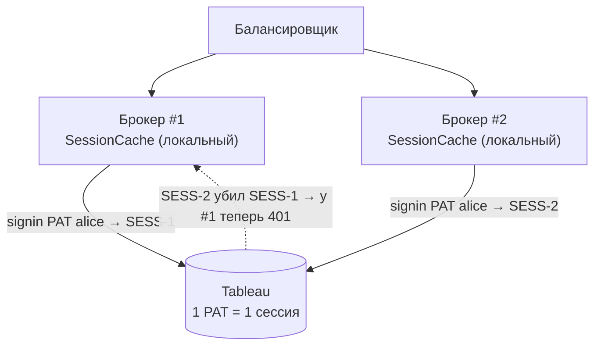
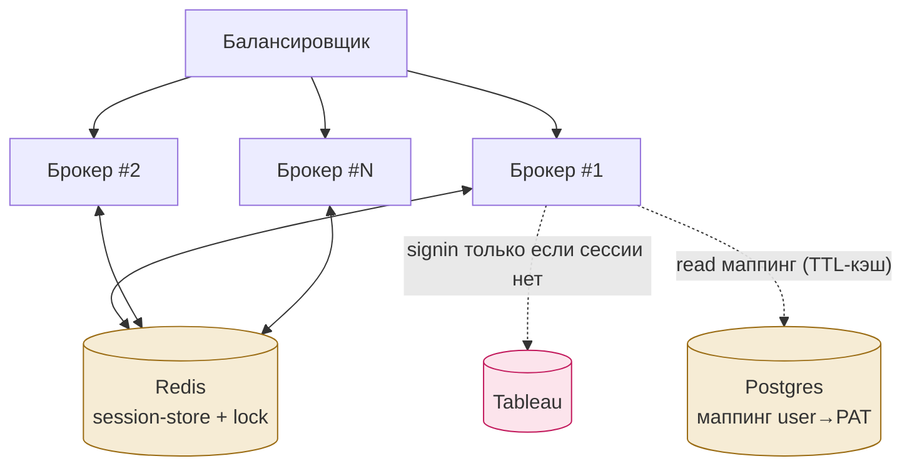
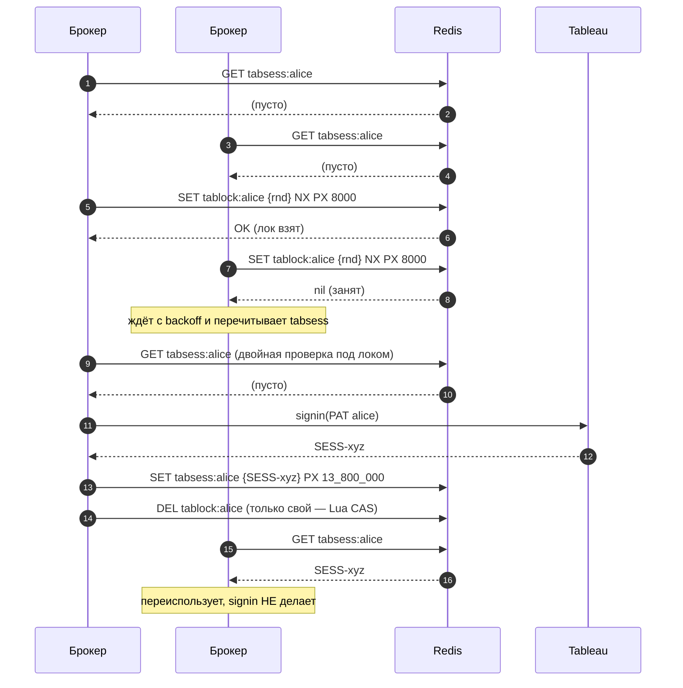
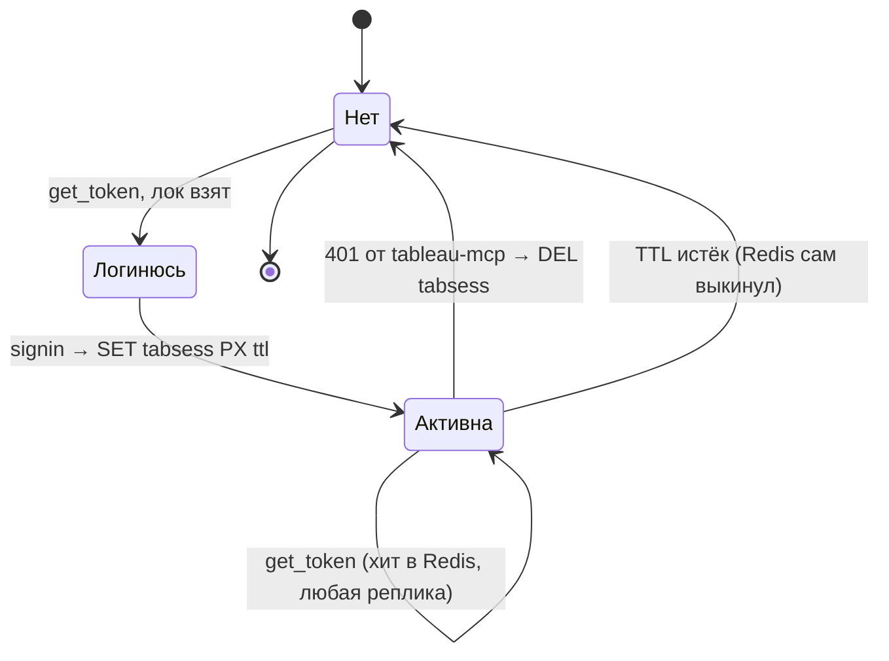

# Shared session-store для брокера (масштабирование на реплики)

Дизайн: как сделать так, чтобы **несколько реплик брокера** `tableau-identity`
делили одни и те же Tableau-сессии и не конфликтовали. Это единственное, что
сейчас держит брокер на одной ноде (см. отчёт по нагрузке).

---

## 1. Проблема

Tableau: **один PAT = одна активная сессия**. Повторный signin тем же PAT
инвалидирует прошлую сессию. Сейчас `SessionCache` — **локальный на инстанс**
(dict в памяти + `asyncio.Lock`). При 2+ репликах:



Реплики «отбирают» сессии друг у друга: лишние signin, периодические 401,
дёрганье Tableau. Горизонтальное масштабирование в таком виде не работает.

---

## 2. Целевая архитектура

Выносим кэш сессий и лок в **общий Redis**. Все реплики видят одну сессию на
юзера; signin делает только одна реплика — под распределённым локом.



Redis в стеке уже есть (его использует ContextForge) — переиспользуем его или
поднимаем отдельный инстанс/БД под сессии.

---

## 3. Модель данных в Redis

| Ключ | Значение | TTL |
|---|---|---|
| `tabsess:{user}` | JSON `{token, site_id, user_id}` — активная сессия Tableau | `SESSION_TTL` (~230 мин, < 240-мин idle Tableau) |
| `tablock:{user}` | случайный токен-владелец лока | короткий (5–10 с), самоистекающий |

- Ключ сессии по **user** (а не по PAT), т.к. связь user↔PAT 1:1 — эквивалентно,
  но user приходит из токена и всегда под рукой.
- TTL сессии держим меньше idle-таймаута Tableau: Redis сам выкинет протухшую.
- Лок — короткоживущий, с авто-истечением, чтобы упавшая реплика не залочила юзера.

---

## 4. Поток `get_token` с распределённым локом

Двойная проверка + лок гарантируют **один signin** даже когда две реплики
одновременно обнаружили отсутствие сессии.



**Освобождение лока — атомарно и только своего** (Lua-скрипт «сравни значение и
удали»), чтобы реплика не сняла чужой лок, взятый после её истечения:

```lua
if redis.call("get", KEYS[1]) == ARGV[1] then
  return redis.call("del", KEYS[1])
else
  return 0
end
```

---

## 5. Жизненный цикл сессии



**Инвалидция на 401** (протухла/отозвана сессия): любая реплика делает
`DEL tabsess:{user}` и повторяет `get_token` — под локом залогинится ровно одна,
остальные подхватят новый токен из Redis.

---

## 6. Отказоустойчивость

- **Redis недоступен** → фолбэк на локальный кэш реплики (как сейчас). Деградируем
  к «одна нода = один PAT», лишние signin возможны, но сервис жив. Логируем WARNING.
- **Лок не удалось взять** → короткий backoff + повторный GET сессии (её мог уже
  создать держатель лока). Ограничиваем число попыток, иначе — прямой signin
  (граничный случай, эквивалент текущего поведения).
- **Держатель лока упал** до записи сессии → лок истечёт сам (PX), другая реплика
  залогинится. Худшее — один лишний signin.
- **Гонка на инвалидции** (двое поймали 401) → `DEL` идемпотентен, повторный
  signin под локом один.

---

## 7. Альтернатива: sticky-роутинг (и почему shared лучше)

| | Shared session-store (Redis) | Sticky по юзеру на балансировщике |
|---|---|---|
| Как | все реплики делят сессию через Redis | юзер всегда попадает на одну реплику |
| Плюс | реплики полностью равноправны; падение ноды не теряет привязку сессии к юзеру | не нужен Redis для сессий |
| Минус | +зависимость Redis (уже в стеке) | нужен hash-по-юзеру на LB; падение ноды → её юзеры релогинятся; неравномерная нагрузка |

Рекомендация — **Redis**: он уже в стеке, даёт равноправные реплики и переживает
перебалансировку без потери сессий. Sticky — запасной вариант, если Redis для
сессий по какой-то причине нельзя.

---

## 8. План внедрения (без ломки текущего)

Публичный интерфейс `SessionCache.get_token(user, pat_name, pat_secret)` и
`invalidate(user)` **не меняется** — меняется только бэкенд:

1. Ввести абстракцию `SessionBackend` с двумя реализациями:
   - `LocalSessionBackend` — текущий dict + `asyncio.Lock` (дефолт, одноузловой);
   - `RedisSessionBackend` — Redis session-store + распределённый лок (см. выше).
2. Выбор по env: `SESSION_STORE=redis` + `REDIS_URL`. Пусто → локальный (обратная
   совместимость, как с YAML/Postgres в других модулях).
3. Тесты: юнит на Redis-бэкенд с фейковым Redis (`fakeredis`) — гонка двух
   «реплик» на один signin, инвалидция, TTL, фолбэк при недоступном Redis.
4. Compose: `SESSION_STORE=redis`, `REDIS_URL=redis://redis:6379/1` (отдельная
   логическая БД от гейта), `depends_on: redis`.

Объём — сопоставим с переносом маппингов в Postgres: один новый модуль +
переключатель + тесты. Ядро брокера и логика связки user↔PAT не затрагиваются.
